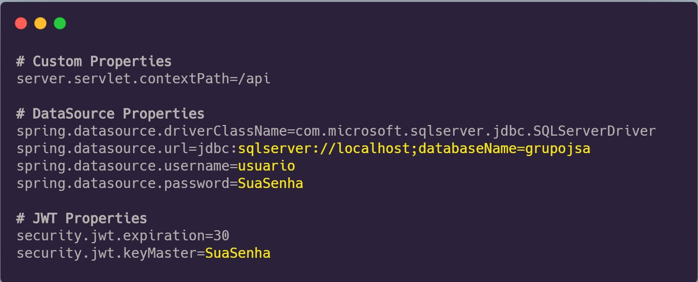

# J. Sá Admin System
> Projeto referente ao sistema administrativo do Grupo J. Sá.

Esse projeto visa incorporar todos os microsistemas existentes na base da empresa, de modo a centralizar as rotinas, atualizações e manutenções, facilitando assim a administração do sistema.   


## Instalação / Começando

Para executar o projeto, será necessário instalar os seguintes programas:

- [JDK 11: Necessário para executar o projeto Java](https://www.oracle.com/java/technologies/javase-jdk11-downloads.html)
- [Maven 3.6.3: Necessário para realizar o build do projeto Java](https://maven.apache.org/download.cgi)
- [IntelliJ Idea: Para desenvolvimento do projeto](https://www.jetbrains.com/pt-br/idea/download)
- [Microsoft Sql Server Express: para o Banco de Dados](https://www.microsoft.com/pt-br/sql-server/sql-server-downloads)

Após a instalação dos programas é possivel testar com os códigos

``` shell 
# JAVA
java -version

# MVN
mvn -v

# SQL Server
sqlcmd -?
```

Para um ambiente ***Dockerizado***
- [Docker](https://www.docker.com/get-started)

Após execute os comandos.
``` shell 
# DOCKER
docker -v

# RAIZ DO PROJETO
docker-compose up -d --build
```


### Configuração Inicial

No Sql Server crie `usuário`, `senha` e `banco de dados` vamos precisar daqui a pouco.


## Desenvolvimento

Para iniciar o desenvolvimento, é necessário clonar o projeto do GitHub no diretório de sua preferência

```shell
git clone https://github.com/williamjesusdev/GrupoJSa.git
cd GrupoJSa/
```
Após clonar e entrar na pasta é possível ver todos os arquivos relacionados ao projeto.


### Construção

Antes de construir o projeto do **Servidor** vamos abri-lo no IntelliJ ou outra IDE de sua escolha e editar o arquivo `application.properties.example`.
```
GrupoJSa
 | server
 | | src
 | | | main
 | | | | java
 | | | | resources
 | | | | | application.properties.example *
 | | | test
```
Primeiramente renomeie o arquivo alterando `.example` por `-dev` com o arquivo aberto altere as informações referente ao `banco de dados` e `chave de assinatura` do JWT. 


Agora para construir o projeto com o Maven, executar o comando abaixo:

```shell
mvn clean install package
```

O comando serve para baixar todas as dependências e criar o diretório *target* com os artefatos construídos, que incluem o arquivo jar do projeto. Além disso, serão executados os testes unitários, e se algum falhar, o Maven exibirá essa informação no console.

Para a construção do projeto da **Web** é necessário entrar na pasta do projeto e efetuar a instalação das dependências.

```shell
# Na Raiz do projeto
cd web

# Com seu gerenciador favorito (Yarn de preferência)
yarn install
#or
npm install
```

### Iniciando 

Na pasta do **Servidor** execute o comando:

```shell
mvn spring-boot:run
```

O Comando iniciará o servidor que conta com a documentação **SWAGGER** que pode ser acessada em `http://localhost:8080/api/swagger-ui.html`


Na pasta da **Web** execute o comando:

```shell
yarn start || npm start
```

O Comando iniciará o frontend da aplicação que pode ser acessada em `http://localhost:3000`


## Features

O projeto serve como base para implementação do seu próprio Sistema Administrativo
* A base do Projeto é a API (Servidor)
* Já foi implementado na a primeira versão do Front-End
* Serão acrescentados outros endpoints e novas funcionalidades


## Licença

O Projeto segue em análise de licença, por enquanto segue utilizando a Licença MIT [LICENSE](LICENSE.md).